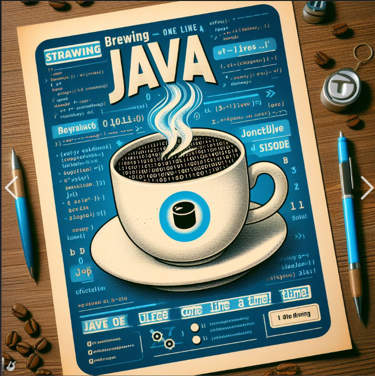

### Introduccion a la programación con JAVA y herramientas de IA

### [Encuentro 1](doc/01-encuentro/README.md)
### [Encuentro 2](doc/02-encuentro/README.md)
### [Encuentro 3](doc/03-encuentro/README.md)
### [Encuentro 4](doc/04-encuentro/README.md)
### [Encuentro 5](doc/05-encuentro/README.md)
### [Encuentro 8](doc/08-encuentro/README.md)

### Links:

- JDK: https://www.oracle.com/java/technologies/downloads/#jdk22-windows
- Visual Estudio: https://code.visualstudio.com/
- Encuentro 01 Video: https://www.youtube.com/live/qAG6cmW_tfo?si=mhrvZOyTYUXY_emF
- Encuentro 01 Presentación: https://docs.google.com/presentation/d/1eVGfMyvpmREl5UO-6B-S-b6Twd4BhmhbWY05jkutKHc/edit#slide=id.p

### Videos Complementarios

- Instalación del JDK: https://youtu.be/9mKhehn1hNs
- Instalación de Visual Studio Code y Extensión de Java: https://youtu.be/1qIwtFYeSs0 
- Instalacion de Git: https://youtu.be/mhMJY4U2gD8
- Introducción al uso de la Consola/Terminal/Cmd: https://youtu.be/MRgZoMIoWxg
- Repaso encuentro 02: https://youtu.be/FRZx4VwrHI4