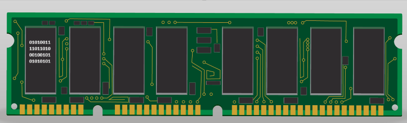
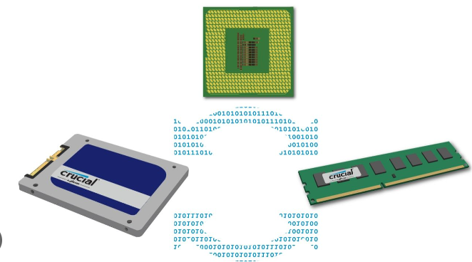
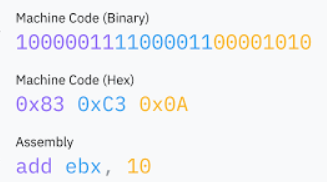
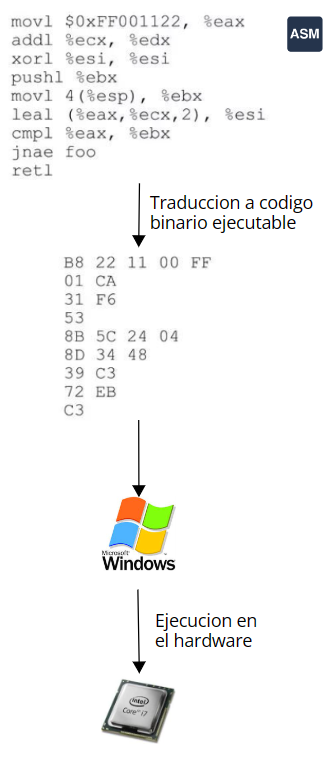
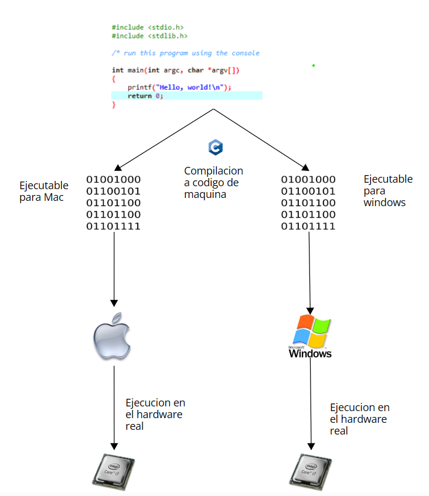
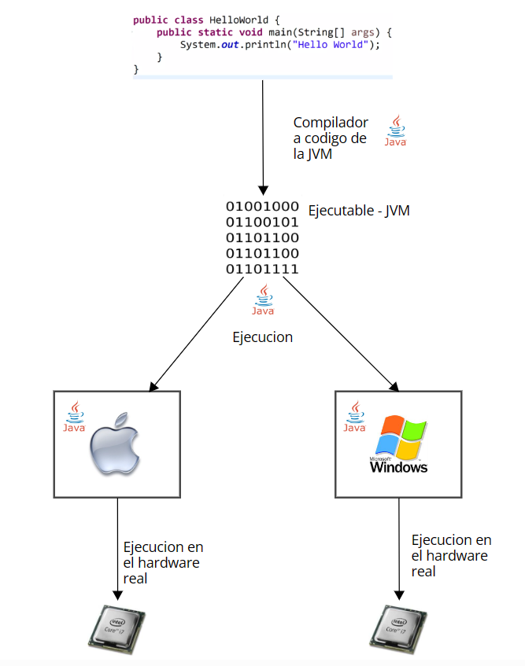
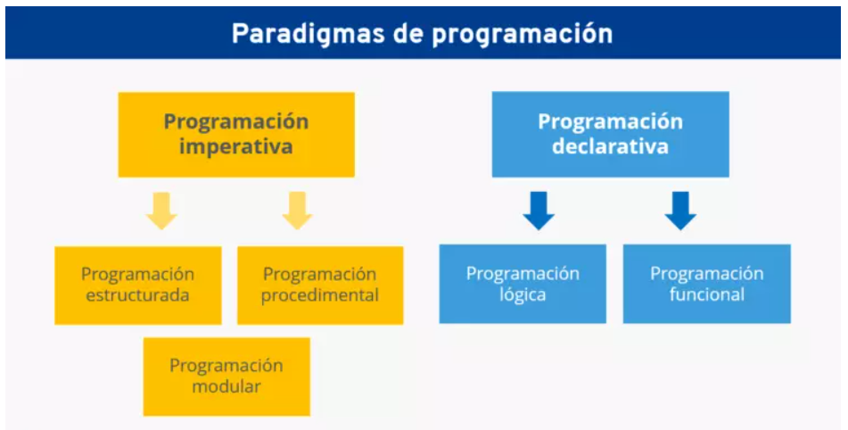

## 1 - Introducción a la programación (Contexto histórico)

Lenguaje Binario, como se almacena un programa en la computadora, donde esta? ¿Cómo se ejecuta? **



Un programa es una secuencia de instrucciones en memoria, estas instrucciones están codificadas en binario, lo que significa que se representan mediante combinaciones de unos y ceros. Estos códigos binarios son interpretados por la unidad central de procesamiento (CPU) de un ordenador, la cual ejecuta las operaciones especificadas en las instrucciones. Además, cada instrucción y dato en el programa tiene una ubicación específica en la memoria del sistema, lo que permite a la CPU acceder y manipular la información de manera eficiente. En el proceso de ejecución, el programa interactúa con los recursos del hardware y puede realizar diversas tareas, desde operaciones aritméticas simples hasta complejas funciones de control y gestión de datos



## Lenguaje de bajo nivel

Un lenguaje de bajo nivel es un tipo de lenguaje de programación que está más cerca del lenguaje de máquina y, por lo tanto, más vinculado a la arquitectura específica del hardware de la computadora. Estos lenguajes proporcionan una representación más directa de las operaciones ejecutadas por la unidad central de procesamiento (CPU) y, a menudo, requieren que el programador tenga un conocimiento más profundo de la estructura del hardware.

El lenguaje ensamblador es un conjunto de operaciones que se corresponden directamente con el conjunto de instrucciones de una arquitectura de computadora específica. Cada instrucción en lenguaje ensamblador representa una operación elemental que la unidad central de procesamiento (CPU) puede llevar a cabo directamente. Estas operaciones están estrechamente vinculadas a las capacidades y características del hardware subyacente, como la aritmética de la CPU, la manipulación de registros y la gestión de la memoria.
El lenguaje ensamblador proporciona una representación más legible para los humanos en comparación con el código binario puro, pero aún así, mantiene una correspondencia directa con las instrucciones de máquina. Cada instrucción en lenguaje ensamblador se traduce directamente a una instrucción de código máquina específica para la arquitectura de la CPU objetivo. Esto facilita la programación a bajo nivel y permite un control preciso sobre el hardware, pero también implica que el código escrito en lenguaje ensamblador es altamente dependiente de la arquitectura del procesador subyacente.





## Lenguajes de alto nivel

Aparición de los primeros lenguajes de alto nivel, Fortran, Cobol, Pascal, C

Un lenguaje de alto nivel es un tipo de lenguaje de programación diseñado para facilitar la programación y mejorar la legibilidad del código, al tiempo que proporciona abstracciones que ocultan los detalles específicos del hardware. Estos lenguajes están más alejados del lenguaje de máquina y son más comprensibles para los programadores. Algunos ejemplos comunes de lenguajes de alto nivel incluyen Python, Java, C++, y JavaScript.

## Características de los lenguajes de alto nivel:

Abstracción: Los lenguajes de alto nivel permiten a los programadores escribir código sin tener que preocuparse demasiado por los detalles de bajo nivel de la arquitectura del hardware. Esto se logra a través de abstracciones que simplifican la programación.

- Portabilidad: El código escrito en un lenguaje de alto nivel suele ser más portátil entre diferentes plataformas y sistemas operativos. Esto se debe a que el código se desarrolla en un nivel más abstracto, y luego un compilador o intérprete se encarga de traducirlo a instrucciones de máquina específicas.

- Productividad: Los lenguajes de alto nivel tienden a ofrecer características que simplifican el proceso de desarrollo, como manejo automático de memoria, recolección de basura, y funciones integradas para realizar tareas comunes.

- Legibilidad: Estos lenguajes suelen tener una sintaxis más clara y expresiva, lo que facilita la lectura y comprensión del código. Esto contribuye a una mayor productividad y mantenibilidad del software.

- Enfoque en la lógica del programa: Los programadores que utilizan lenguajes de alto nivel pueden centrarse más en la lógica del programa y la resolución de problemas, en lugar de ocuparse de detalles específicos de implementación a nivel de máquina.

Es importante destacar que, aunque los lenguajes de alto nivel ofrecen muchas ventajas, también pueden tener un rendimiento ligeramente inferior en comparación con los lenguajes de bajo nivel, como el ensamblador. Sin embargo, las mejoras en la velocidad de los procesadores y la optimización de los compiladores han mitigado en gran medida esta diferencia.

### Compilacion a codigo de maquina




### Compilacion Codigo intermedio



### Paradigmas



## Programación imperativa

Es la forma clasica de proramacion basada en cambios de estado, donde se indica en forma secuencial a la computadora lo que debe hacer (Secuancia de instrucciones)


### Programacion estructurada

La programación estructurada es una caracteristica de programación imperativa donde aparecen el uso de bucles estructuras de control como condiciones.

### Programacion procedimental

Es otra caracteristica de la programacion imperativa donde aparece el concepto de funcion que permiten encapsular bloques de código en unidades lógicas y reutilizables, lo que contribuye a la modularidad y a una mayor legibilidad del código. Al utilizar funciones, los programadores pueden dividir un programa en partes más pequeñas y manejables, facilitando la comprensión, el mantenimiento y la depuración del código.
Estas estructuras proporcionan una forma clara y organizada de expresar algoritmos y lógica de programación.

### Programación Orientada a Objetos

La programación orientada a objetos se utiliza para modelar y representar de manera más natural el mundo real en el software.
Esto se consigue agrupando datos y funciones relacionados en modulos llamados **clases**.
Este enfoque ofrece ventajas como la modularidad, reutilización de código, mantenibilidad, flexibilidad y facilidad de escalamiento. Lenguajes de programación populares que admiten la programación orientada a objetos incluyen Java, C++, Python, C#, y muchos más. La POO ha demostrado ser una herramienta poderosa para el desarrollo de software en una amplia variedad de aplicaciones, desde aplicaciones de escritorio hasta sistemas embebidos y aplicaciones web.

## Programación declarativa

La programación declarativa es un paradigma de programación que se centra en describir el resultado deseado sin especificar el flujo de control o los pasos detallados para alcanzar ese resultado. En lugar de decirle a la computadora cómo realizar una tarea, el programador se enfoca en declarar qué es lo que desea lograr. Este enfoque permite a la máquina determinar la mejor manera de ejecutar la tarea.
HTML/CSS/SQL son ejemplos de lenguajes declarativos

````html
<b>Hola Mundo</b>
````

````sql
select apellido from alumnos order by edad asc;
````

## Programación funcional

La programación funcional es un paradigma de programación en el que las funciones son tratadas como ciudadanos de primera clase y la computación se basa en la evaluación de funciones matemáticas y evita el cambio de estado y los datos mutables. Es decir, en lugar de enfocarse en una secuencia de instrucciones que cambian el estado del programa, se enfoca en la definición y aplicación de funciones.


### Programación logica

La programación lógica es un paradigma de programación basado en la lógica formal, específicamente en la lógica de predicados de primer orden. A diferencia de otros paradigmas de programación como el imperativo, el orientado a objetos o el funcional, en la programación lógica se describen los problemas en términos de relaciones lógicas y reglas, y se utilizan motores de inferencia para encontrar soluciones que satisfagan esas relaciones y reglas.


## Algunos lenguajes de programación y sus aplicaciones más comunes

- Python: IA, Big Data, Ciencia de datos.
- JS: Apliciones Web 
- PHP: Sitios Web - Ecommerce
- Java: Sistemas Financieros, Bancos, Seguros, Grandes Empresas y Apps para Android!
- C: Bajo nivel, software de Base, Sistemas Operativos, Drivers, IoT
- C++: Videojuegos, Servidores.
- SQL: Consulta a bases de datos
- HTML/CSS: Sitios webs
- Swift: Aplicaciones para iOS y macOS


## Introducción a Java

### La Estructura Básica de un Programa

Java es un lenguaje de programación orientado a objetos ampliamente utilizado en el desarrollo de una amplia gama de aplicaciones, desde aplicaciones de escritorio hasta aplicaciones web y móviles. Una de las características distintivas de Java es su portabilidad, lo que significa que los programas Java pueden ejecutarse en diferentes plataformas sin necesidad de realizar modificaciones.

En Java, un programa comienza con la definición de al menos una clase. La clase principal es la que contiene el método main, que es el punto de entrada de cualquier programa Java. La sintaxis para definir una clase principal en Java es la siguiente:

````java
public class NombreDeLaClase {
    // Contenido de la clase
}
````

La palabra clave **public** indica que esta clase es accesible desde cualquier parte del programa y la palabra **class** indica que estamos definiendo una clase.

La Función main:

El método **main** es el punto de entrada de un programa Java. Cuando se ejecuta un programa Java, el sistema comienza ejecutando el método main de la clase principal. La sintaxis para definir el método main es la siguiente:

````java
public class HelloWorld {
    public static void main(String[] args) {
        System.out.println("Hola mundo!");
    }
}
````

La palabra clave **public** indica que el método main es accesible desde cualquier parte del programa.
La palabra clave **static** indica que el método main pertenece a la clase en sí misma, no a una instancia particular de la clase.

**void** especifica que el método main no devuelve ningún valor.

**String[] args** es un parámetro que permite pasar argumentos desde la línea de comandos al programa.

En Java, el nombre del archivo debe coincidir exactamente con el nombre de la clase principal, incluida la capitalización. Por ejemplo, si la clase principal se llama **HelloWorld**, el nombre del archivo debe ser **HelloWorld.java**.
En este ejemplo, la clase principal se llama HelloWorld y contiene un único método main que imprime "¡Hola, mundo!" en la consola cuando se ejecuta el programa.
