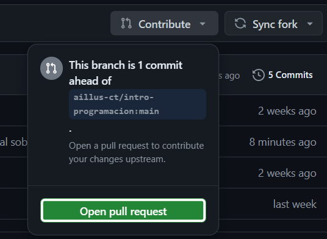
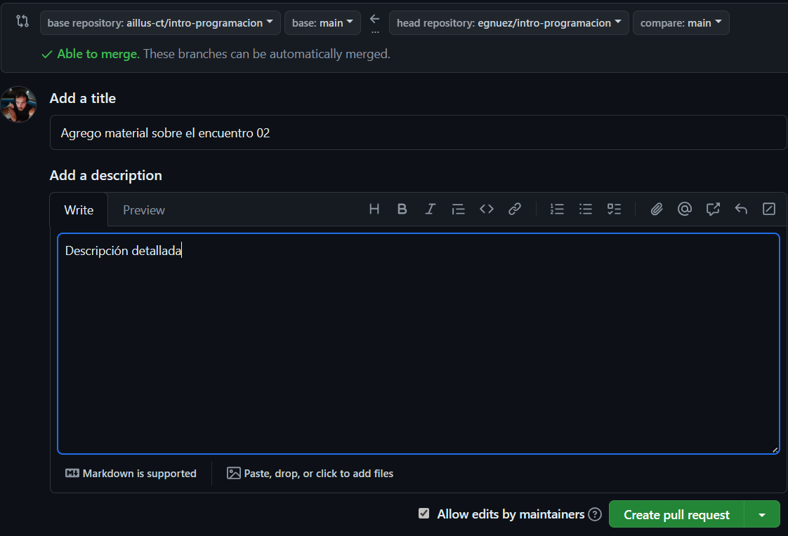

# Introduccion a GIT


- ***Sistema de control de versiones:*** Software que ayuda a gestionar y mantener un registro de los cambios realizados en los archivos a lo largo del tiempo.

- ***Repositorio:*** Un contenedor que almacena el historial completo de un proyecto, incluyendo todas sus versiones y cambios.


### ¿Ventajas de usar con Sistema de control de versiones?

- ***Historial de Cambios:*** Permite ver qué cambios se han hecho, quién los hizo y cuándo.

- ***Deshacer Cambios:*** Posibilidad de revertir a versiones anteriores.

- ***Colaboración:*** Facilita el trabajo en equipo al permitir que múltiples personas trabajen en el mismo proyecto de manera ordenada.

### Casos de uso más comunes de Git:

- ***Código fuente de aplicaciones:*** Se utilizan para mantener y compartir codigo fuente de programas y aplicaciones ya sea en forma publica o privada.

- ***Documentación:*** Mantener un registro de versiones de documentos importantes.

- ***Diseño:*** Gestión de archivos de diseño gráfico, permitiendo recuperar versiones anteriores.

- ***Investigación:*** Control de versiones de datos y scripts en proyectos de investigación.

### Que es github?

GitHub es una plataforma basada en la web que utiliza Git como sistema de control de versiones.
GitHub no solo almacena repositorios, sino que también ofrece herramientas para la colaboración y gestión de proyectos.

### Diferencias y Relación entre Git y GitHub:

- ***Git:*** Es la herramienta que gestiona el historial de cambios localmente en la computadora local.

- ***GitHub:*** Es un servicio que permite almacenar los repositorios de Git en la nube, facilitando la colaboración en línea.


## Práctica

- Navegar por la cuenta de github de Aillus
- Creación de una cuenta personal en github

## Comandos Esenciales ##

- ***git clone [ruta repositorio]***: Bajar un repositorio a la computadora local

- ***git status***: Ver el estado de los archivos en el directorio de trabajo y la zona de preparación.

- ***git add [archivo]***: Preparar un archivo específico para ser confirmado.

- ***git commit -m "mensaje"***: Confirmar los cambios con un mensaje descriptivo.

- ***git push***: Subimos los cambios locales a nuestro repositorio remoto

- ***git pull***: Actualizamos los cambios remotos en nuestra máquina local

## Flujo de trabajo básico en Git:

- **Fork**: Hacer una copia del proyecto en el cual queremos trabajar en nuestra cuenta de github


- **Clonar nuestro repositorio:** Esto consiste en bajarse a la computadora local una copia de los archivos del repositorio sobre el cual queremos trabajar

```bash
git clone https://github.com/[usuario]/[nombre-repositorio]
```

- **Modificaciones:** Hacer cambios en los archivos en la carpeta de trabajo local

- **Preparar los cambios:** Añadir los cambios a la zona de preparación (staging area) usando el comando *git add*

```bash
git add .
```

- **Confirmar cambios**: Guardar los cambios en el repositorio local usando *git commit*

```bash
git commit -m "Breve descripcion del cambio realizado"
```

- **Subir los cambios**: Copiamos los camnios al repositorio remoto (git push):

```bash
git push
```

- **Pull request**: Se pide permiso para integrar los cambios en el proyecto original





## Práctica

1. Clonar repositorio del curso (**git clone**)
2. Realizar cambios creando una carpeta con el nombre del alumno en la carpeta "alumnos"y dentro de esta un archivo HelloWorld.java (Copiarlo del primer encuentro)
3. Ver el estado del repositorio local (**git status**)
4. Añadir los cambios (**git add**)
5. Confirmar los cambios (**git commit**)
6. Llevar los cambios mi repositorio remoto (git push)
7. Hacer el pull request
8. Revisar que los cambios fueron aprobados